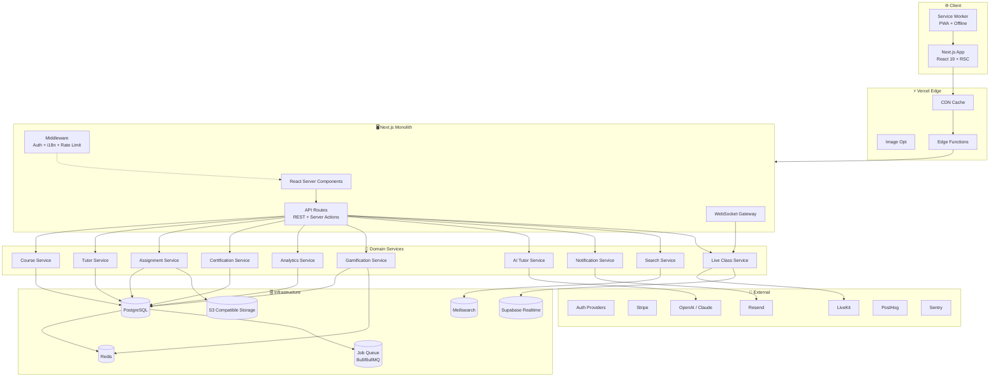
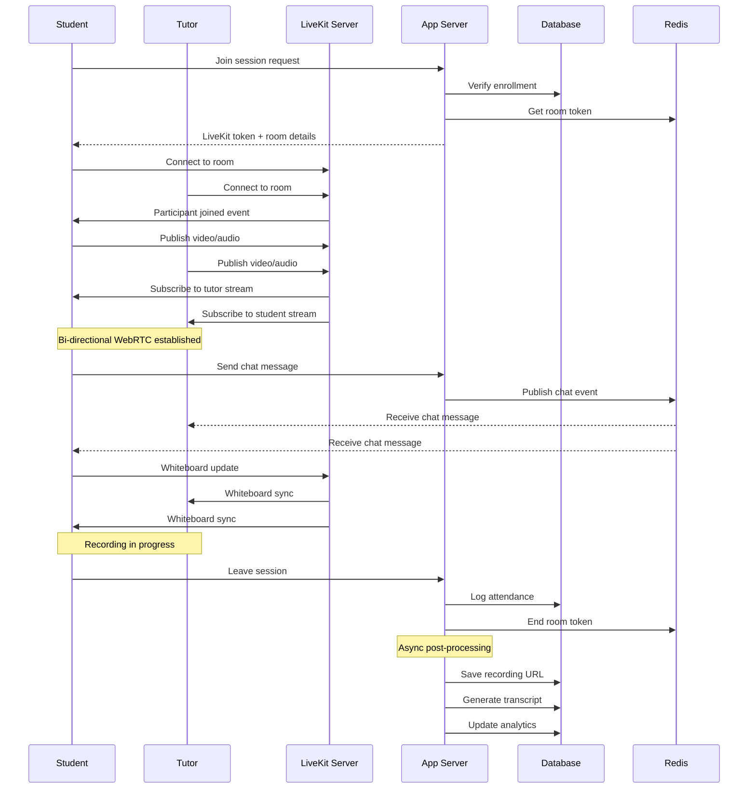
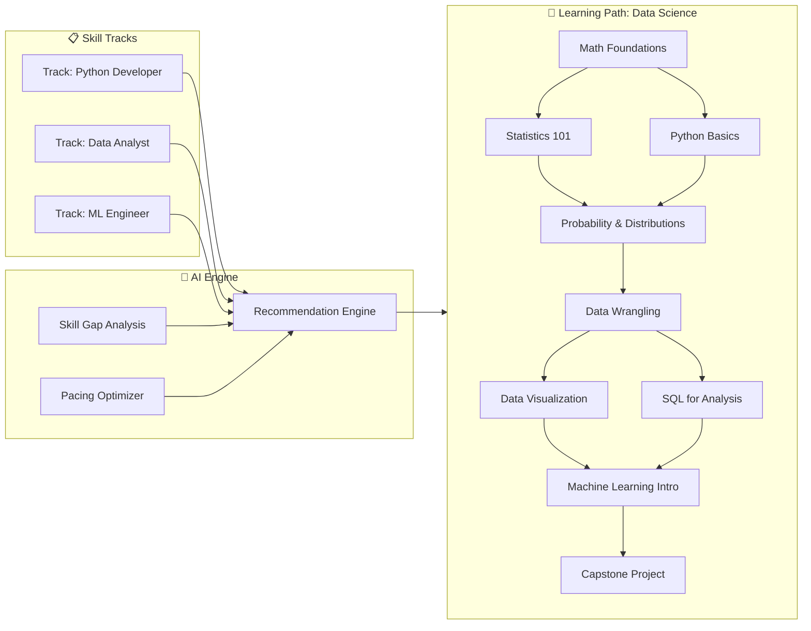
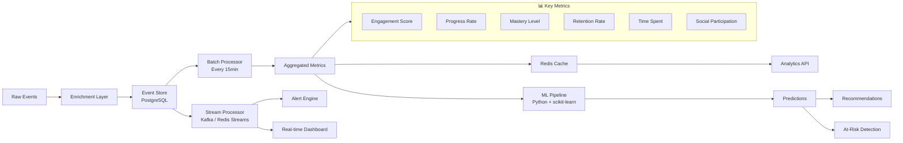
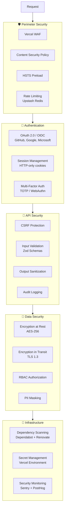
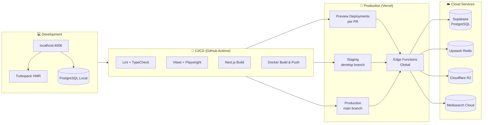

# 🏗️ EDUVERSE — Architecture Guide

> **Version:** 1.0.0 | **Last Updated:** 2025-05

---

## Table of Contents

- [System Architecture](#system-architecture)
- [Layer Architecture](#layer-architecture)
- [Component Architecture](#component-architecture)
- [Live Classes Architecture](#live-classes-architecture)
- [Learning Paths Architecture](#learning-paths-architecture)
- [Student Analytics Pipeline](#student-analytics-pipeline)
- [Data Flow](#data-flow)
- [State Management](#state-management)
- [Security Architecture](#security-architecture)
- [Deployment Architecture](#deployment-architecture)

---

## System Architecture

EDUVERSE follows a **layered microservices architecture** with a Next.js monolith as the orchestration layer, delegating to specialized services for core domains.



### Key Principles

1. **Server-First Rendering** — React Server Components minimize client JavaScript
2. **Domain-Driven Design** — Each service owns its data and logic
3. **Eventual Consistency** — Async job queue for non-critical operations
4. **API as a Product** — Clean, versioned, documented APIs

---

## Layer Architecture

### 1. Presentation Layer (`src/app/`)

```
app/
├── (dashboard)/          # Protected layout with sidebar
│   ├── page.tsx          # Dashboard home
│   ├── loading.tsx       # Route-level loading state
│   └── error.tsx         # Route-level error boundary
├── courses/
│   ├── page.tsx          # Course listing (RSC)
│   ├── [courseId]/
│   │   ├── page.tsx      # Course detail
│   │   └── modules/
│   │       └── [moduleId]/
│   │           └── page.tsx  # Module content
├── live/
│   ├── page.tsx          # Live class listing
│   └── [sessionId]/
│       └── page.tsx      # Live session player
├── tutors/
│   ├── page.tsx          # Tutor discovery & matching
│   └── [tutorId]/
│       └── page.tsx      # Tutor profile
├── assignments/
│   ├── page.tsx          # Assignment listing
│   └── [assignmentId]/
│       └── page.tsx      # Submission & grading
├── certificates/
│   └── page.tsx          # Certification center
├── messages/             # In-app messaging
├── profile/              # User profile
├── settings/             # Account settings
└── api/                  # API routes
```

### 2. Application Layer (`src/components/`)

| Directory | Purpose |
|-----------|---------|
| `ui/` | shadcn/ui primitives (button, card, dialog, etc.) |
| `layout/` | Sidebar, Topbar, MainLayout |
| `courses/` | CourseCard, ModuleList, LessonPlayer |
| `live/` | VideoPlayer, Whiteboard, ParticipantGrid |
| `tutors/` | TutorCard, MatchingForm, AvailabilityCalendar |
| `assignments/` | SubmissionForm, GradingRubric, FileUpload |
| `certificates/` | CertificatePreview, BadgeDisplay |
| `analytics/` | ActivityHeatmap, ProgressChart, SkillGraph |
| `gamification/` | StreakIndicator, XPBar, AchievementCard |
| `shared/` | ErrorBoundary, SuspenseFallback, EmptyState |

### 3. Data Layer (`src/lib/`)

| Module | Purpose |
|--------|---------|
| `db.ts` | Database client (Prisma) |
| `auth.ts` | Authentication helpers |
| `api-client.ts` | API fetch wrapper with error handling |
| `validations/` | Zod schemas for all forms |
| `utils.ts` | cn(), formatDate, etc. |
| `constants.ts` | App-wide constants |
| `hooks/` | Custom React hooks |

---

## Live Classes Architecture

Real-time learning sessions using WebRTC with LiveKit infrastructure.



### Live Class Components

| Component | Technology | Purpose |
|-----------|------------|---------|
| **Video Streaming** | LiveKit WebRTC | Low-latency bi-directional video |
| **Whiteboard** | Canvas + WebSockets | Collaborative drawing & annotations |
| **Screen Sharing** | LiveKit screen share | Tutor code demos, slide presentations |
| **Breakout Rooms** | LiveKit rooms API | Small group discussions |
| **Recording** | LiveKit Egress | Auto-record to S3 |
| **Transcription** | Deepgram / Whisper | Real-time captions + search transcripts |
| **Chat** | Supabase Realtime | In-session Q&A and messaging |

### Quality of Service

| Metric | Target | Monitoring |
|--------|--------|------------|
| Latency (p95) | < 200ms | LiveKit metrics |
| Packet loss | < 1% | WebRTC stats |
| Join time | < 3s | Sentry performance |
| Recording delay | < 5s | Custom health check |

---

## Learning Paths Architecture

Adaptive learning paths powered by prerequisite graphs and AI recommendations.



### Path Determination Algorithm

```
For each student S and course C:
  1. Compute prerequisite completion score
  2. Factor in learning pace (time per module)
  3. Apply learning style vector (visual/reading/interactive)
  4. Weight by student goal (certification/skill/mastery)
  5. Return ranked list of recommended next modules
```

### Skill Graph

Each student maintains a **skill graph** where:
- **Nodes** = Skills (e.g., "Linear Regression", "SQL JOINs")
- **Edges** = Prerequisite relationships
- **Weights** = Mastery level (0.0 to 1.0)
- **Decay** = Skill decay over time without reinforcement

---

## Student Analytics Pipeline



### Event Taxonomy

| Event Category | Examples | Volume (est.) |
|---------------|----------|---------------|
| **Page Views** | Course page, lesson page, dashboard | 10M/day |
| **Interactions** | Click, scroll, hover, video play/pause | 50M/day |
| **Learning** | Quiz attempt, assignment submit, lesson complete | 5M/day |
| **Social** | Message sent, forum post, tutor request | 2M/day |
| **System** | Login, logout, error, performance | 1M/day |

### Analytics Metrics Definitions

| Metric | Formula | Update Frequency |
|--------|---------|-----------------|
| **Engagement Score** | (active_minutes / total_minutes) * social_bonus | Real-time |
| **Progress Rate** | completed_modules / total_modules_in_path | Daily |
| **Mastery Level** | weighted_avg(quiz_scores * recency_factor) | Per-assessment |
| **Retention Rate** | active_users_in_cohort / total_users_in_cohort | Weekly |
| **At-Risk Score** | logistic_regression(engagement, progress, time, social) | Daily |

---

## Data Flow

### Request Flow (Page Load)

```
Browser Request
    │
    ▼
Vercel Edge Network
    │ (cache hit? → return cached HTML)
    │ (cache miss → forward to origin)
    ▼
Next.js Middleware
    │ Auth check, i18n detection, rate limiting
    ▼
Layout (RootLayout)
    │ Providers, fonts, metadata
    ▼
Page (Server Component)
    │ Parallel data fetching with Promise.all
    ├── Course data → Prisma → PostgreSQL
    ├── User data → Prisma → PostgreSQL
    ├── Progress data → Redis cache
    └── Recommendations → AI service
    │
    ▼
Suspense Boundaries → Client Components hydrate
    │ Framer Motion animations mount
    ▼
Interactive Page
```

### Mutation Flow (Form Submission)

```
User submits form
    │
    ▼
Server Action / API Route
    │ Zod validation → transform
    │
    ├── Write to database (Prisma)
    ├── Invalidate cache tags (revalidateTag)
    ├── Queue async jobs (email, analytics)
    └── Return response + revalidated data
    │
    ▼
React Server Component re-renders
    │ Streaming update to client
    ▼
UI updates with new data
```

---

## State Management

| Concern | Solution | When to Use |
|---------|----------|-------------|
| **Server State** | React Server Components | Default for data fetching |
| **URL State** | next/navigation (searchParams) | Shareable, bookmarkable state |
| **Form State** | React Hook Form + Zod | All forms |
| **Client State** | Zustand | Global modals, toasts, theme |
| **Cache** | Next.js unstable_cache + Redis | Expensive computations |
| **Real-time** | Supabase Realtime / WebSocket | Live classes, chat |

---

## Security Architecture



---

## Deployment Architecture



---

## Performance Targets

| Metric | Target | Measurement |
|--------|--------|-------------|
| LCP (Largest Contentful Paint) | < 1.5s | Vercel Analytics |
| FID (First Input Delay) | < 50ms | Vercel Analytics |
| CLS (Cumulative Layout Shift) | < 0.05 | Vercel Analytics |
| TTFB (Time to First Byte) | < 200ms (edge) | Vercel Analytics |
| Lighthouse Performance | > 95 | CI check |
| API Response Time (p95) | < 100ms | Sentry |
| Database Query (p95) | < 50ms | Prisma logging |

---

## Related Documentation

- [DESIGN_SYSTEM.md](./DESIGN_SYSTEM.md) — UI component design guidelines
- [SECURITY.md](./SECURITY.md) — Security policies and vulnerability reporting
- [CONTRIBUTING.md](./CONTRIBUTING.md) — Development workflow and standards
- [CHANGELOG.md](./CHANGELOG.md) — Release history

---

<div align="center">
  <sub>Copyright © 2025 EDUVERSE. All rights reserved.</sub>
</div>
