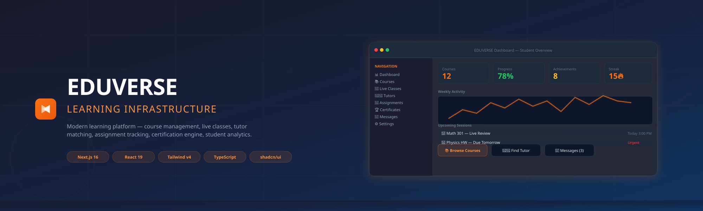
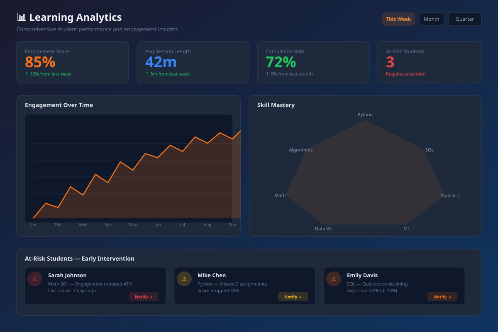
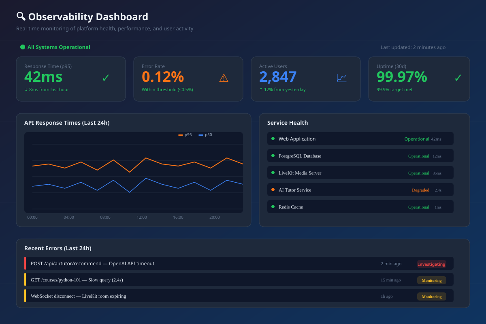
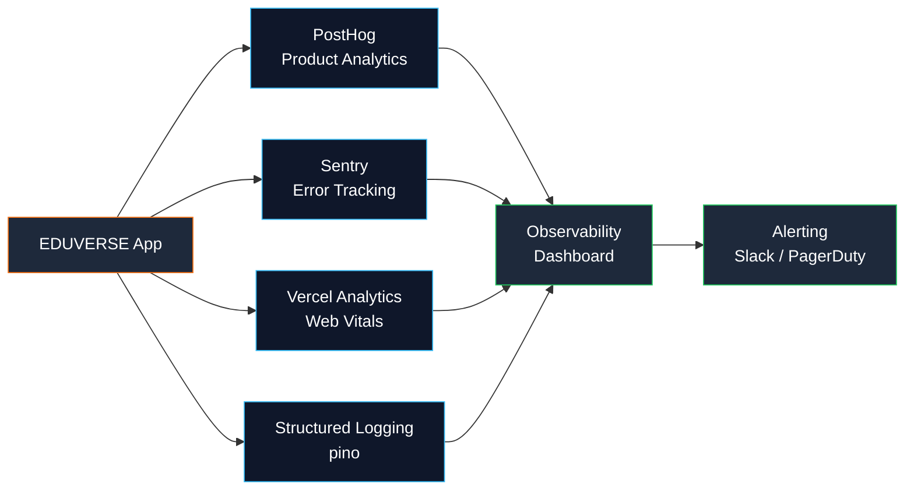

<div align="center">
  
  <br /><br />

  # 📚 EDUVERSE — Learning Infrastructure

  <p align="center">
    <strong>Modern learning platform — course management, live classes, tutor matching,<br />assignment tracking, certification engine, student analytics.</strong>
  </p>

  <p align="center">
    
    
    
    
    
    
  </p>

  <p align="center">
    <a href="#-features">Features</a> •
    <a href="#-tech-stack">Tech Stack</a> •
    <a href="#-architecture">Architecture</a> •
    <a href="#-getting-started">Getting Started</a> •
    <a href="#-deployment">Deployment</a> •
    <a href="#-roadmap">Roadmap</a>
  </p>

  <br />
</div>

---

## 📋 Table of Contents

- [Overview](#-overview)
- [Features](#-features)
- [Tech Stack](#-tech-stack)
- [Screenshots](#-screenshots)
- [Architecture](#-architecture)
- [Getting Started](#-getting-started)
- [Environment](#-environment)
- [Deployment](#-deployment)
- [Docker](#-docker)
- [Engineering Highlights](#-engineering-highlights)
- [Project Structure](#-project-structure)
- [Roadmap](#-roadmap)
- [Scalability](#-scalability)
- [Observability](#-observability)
- [Contributing](#-contributing)
- [Security](#-security)
- [License](#-license)
- [Contact](#-contact)

---

## 🧭 Overview

EDUVERSE is a **learning infrastructure platform** inspired by the best of **Duolingo** (gamified progression), **Discord** (community & live interaction), and **Notion** (modular, block-based content). Built for institutions, tutors, and self-learners who want a modern, delightful learning experience.

> **"Learning should feel like play, work like flow, and growth like discovery."**

### Why EDUVERSE?

| Challenge | EDUVERSE Solution |
|-----------|------------------|
| Boring course UIs | Gamified progress, streaks, achievements |
| Scattered learning tools | Unified dashboard — courses, live, assignments, certificates |
| Static content | Interactive live classes with real-time whiteboarding |
| No personalization | AI tutor recommendations & adaptive learning paths |
| Opaque progress | Rich analytics with heatmaps, skill graphs, predictive insights |

---

## ✨ Features

### 📊 Dashboard & Analytics
- **Student Overview** — Real-time progress dashboard with heatmaps, activity graphs, and streak tracking
- **Learning Analytics** — Time spent, completion rates, skill mastery, and predictive performance insights
- **Instructor Console** — Class-level analytics, student engagement metrics, and intervention alerts

### 📚 Course Management
- **Modular Content** — Courses structured as modules, lessons, and micro-learning units
- **Rich Media** — Video embedding, interactive code sandboxes, embedded quizzes
- **Adaptive Paths** — AI-driven recommendations based on performance and learning style
- **SCORM/xAPI** — Standard-compliant content packaging and tracking

### 🎥 Live Classes
- **Real-time Streaming** — WebRTC-powered low-latency video with LiveKit
- **Interactive Whiteboard** — Collaborative drawing, annotations, and shared notes
- **Breakout Rooms** — Small group discussions with instructor monitoring
- **Recording & Playback** — Auto-recorded sessions with chapter markers and searchable transcripts

### 👨‍🏫 Tutor Matching
- **Smart Matching** — Algorithm-based pairing by subject, availability, learning style, and personality
- **Ratings & Reviews** — Transparent feedback system with verified session history
- **Availability Calendar** — Sync with Google/Outlook calendar for scheduling
- **1-on-1 & Group** — Both private sessions and small group tutoring

### 📝 Assignments & Assessments
- **Auto-graded** — Multiple choice, fill-in-blank, code evaluation, and essay scoring with AI
- **Plagiarism Detection** — Integrated similarity checking
- **Rubric-based** — Custom rubrics with weighted criteria for manual grading
- **Peer Review** — Structured peer assessment workflows

### 🏆 Certification Engine
- **Digital Credentials** — Verifiable certificates with blockchain-anchored hashes
- **Badge System** — Micro-credentials for skill milestones
- **Shareable** — LinkedIn integration, Open Badges 3.0 compliant
- **Proctored Exams** — Browser lockdown, webcam monitoring, AI proctoring

### 💬 Communication
- **Real-time Messaging** — Typing indicators, read receipts, file sharing
- **Course Forums** — Threaded discussions per course/module
- **Notifications** — Email, push, and in-app with granular preferences
- **Announcements** — Instructor broadcast with read tracking

### 🎮 Gamification
- **Streak System** — Daily login streaks with multipliers and rewards
- **Experience Points** — XP for completing lessons, assignments, and participation
- **Leaderboards** — Class, course, and global rankings (with privacy controls)
- **Achievements** — Unlockable badges for milestones and special accomplishments

---

## 🛠️ Tech Stack

| Category | Technology |
|----------|-----------|
| **Framework** | Next.js 16.2.6 (App Router, Turbopack) |
| **UI Layer** | React 19.2.4, Framer Motion, shadcn/ui |
| **Styling** | Tailwind CSS v4, CSS Modules, PostCSS |
| **Language** | TypeScript 5.x (strict mode) |
| **State** | React Server Components + Zustand (client) |
| **Forms** | React Hook Form + Zod validation |
| **Icons** | Lucide React |
| **Auth** | NextAuth.js v5 / Supabase Auth |
| **Database** | PostgreSQL + Prisma ORM |
| **Real-time** | Supabase Realtime / WebSockets |
| **Live Classes** | LiveKit (WebRTC) |
| **AI/ML** | OpenAI API, Anthropic Claude |
| **Search** | Meilisearch |
| **Payments** | Stripe |
| **Email** | Resend / SendGrid |
| **Observability** | PostHog, Sentry, Vercel Analytics |
| **Rate Limiting** | Upstash Redis |
| **Testing** | Vitest, Playwright, MSW |
| **CI/CD** | GitHub Actions, Vercel |
| **Container** | Docker, Docker Compose |

---

## 📸 Screenshots

<div align="center">
  <table>
    <tr>
      <td></td>
      <td></td>
    </tr>
    <tr>
      <td align="center"><em>Student Dashboard</em></td>
      <td align="center"><em>Learning Analytics</em></td>
    </tr>
    <tr>
      <td></td>
      <td></td>
    </tr>
    <tr>
      <td align="center"><em>Mobile Responsive</em></td>
      <td align="center"><em>Observability Dashboard</em></td>
    </tr>
  </table>
</div>

---

## 🏗️ Architecture

```mermaid
graph TB
    %% ── Layers ──
    subgraph Client["🌐 Client Layer"]
        direction TB
        WEB["Next.js App (Port 4006)"]
        PWA["Progressive Web App"]
        SSG["Static Generation (SSG)"]
    end

    subgraph CDN["📦 CDN & Edge"]
        VERCEL["Vercel Edge Network"]
        IMG_OPT["Image Optimization"]
        EDGE_FN["Edge Functions"]
    end

    subgraph App["⚡ Application Layer"]
        direction TB
        RSC["React Server Components"]
        API["API Routes (REST + tRPC)"]
        WS["WebSocket Gateway"]
        AUTH["Authentication Service"]
    end

    subgraph Services["🔌 Platform Services"]
        direction TB
        LMS["Course Engine"]
        LIVE["Live Class Service<br/>LiveKit / WebRTC"]
        TUTOR["Tutor Matching Engine"]
        ASSIGN["Assignment Service"]
        CERT["Certification Engine"]
        ANALYTICS["Analytics Pipeline"]
        GAMIFY["Gamification Engine"]
        AI_ENG["AI Tutor Service"]
    end

    subgraph Data["🗄️ Data Layer"]
        direction TB
        PG[("PostgreSQL<br/>Primary Database")]
        REDIS[("Redis / Upstash<br/>Cache + Rate Limiting")]
        MEILI[("Meilisearch<br/>Full-text Search")]
        S3[("Object Storage<br/>S3 / R2")]
        REALTIME[("Supabase Realtime<br/>Pub/Sub")]
    end

    subgraph External["🔗 External Integrations"]
        STRIPE["Stripe<br/>Payments"]
        RESEND["Resend<br/>Email"]
        POSTHOG["PostHog<br/>Analytics"]
        SENTRY["Sentry<br/>Error Tracking"]
        OPENAI["OpenAI / Claude<br/>AI Services"]
    end

    %% ── Connections ──
    WEB --> VERCEL
    VERCEL --> RSC
    WEB --> PWA
    WEB --> SSG
    RSC --> API
    RSC --> WS
    API --> AUTH
    API --> LMS
    API --> LIVE
    API --> TUTOR
    API --> ASSIGN
    API --> CERT
    API --> ANALYTICS
    API --> GAMIFY
    API --> AI_ENG

    LMS --> PG
    LMS --> MEILI
    LIVE --> REALTIME
    TUTOR --> PG
    TUTOR --> REDIS
    ASSIGN --> PG
    ASSIGN --> S3
    CERT --> PG
    ANALYTICS --> PG
    ANALYTICS --> REDIS
    GAMIFY --> PG
    GAMIFY --> REDIS
    AI_ENG --> OPENAI

    PG --> S3
    API --> STRIPE
    API --> RESEND
    RSC --> POSTHOG
    RSC --> SENTRY

    %% ── Styling ──
    classDef client fill:#1e293b,stroke:#f97316,stroke-width:2px,color:#fff
    classDef cdn fill:#0f172a,stroke:#38bdf8,stroke-width:2px,color:#fff
    classDef app fill:#1e293b,stroke:#22c55e,stroke-width:2px,color:#fff
    classDef svc fill:#1e293b,stroke:#f97316,stroke-width:1px,color:#e2e8f0
    classDef data fill:#0f172a,stroke:#a855f7,stroke-width:2px,color:#fff
    classDef ext fill:#0f172a,stroke:#64748b,stroke-width:1px,color:#94a3b8
    class WEB,PWA,SSG client
    class VERCEL,IMG_OPT,EDGE_FN cdn
    class RSC,API,WS,AUTH app
    class LMS,LIVE,TUTOR,ASSIGN,CERT,ANALYTICS,GAMIFY,AI_ENG svc
    class PG,REDIS,MEILI,S3,REALTIME data
    class STRIPE,RESEND,POSTHOG,SENTRY,OPENAI ext
```



---

## 🚀 Getting Started

### Prerequisites

- Node.js >= 20.0.0
- npm >= 10.0.0
- PostgreSQL >= 16
- Redis (optional, for rate limiting)

### Installation

```bash
# Clone the repository
git clone https://github.com/eduverse/learning-platform.git
cd learning-platform

# Install dependencies
npm install

# Copy environment variables
cp .env.example .env.local

# Set up the database
npx prisma generate
npx prisma db push

# Start development server (Turbopack)
npm run dev
```

Open [http://localhost:4006](http://localhost:4006) to see the app.

### Available Scripts

| Script | Description |
|--------|-------------|
| `npm run dev` | Start dev server with Turbopack on port 4006 |
| `npm run build` | Production build |
| `npm run start` | Start production server |
| `npm run lint` | Run ESLint with strict checks |
| `npm run typecheck` | Run TypeScript type checking |
| `npm run format` | Format code with Prettier |
| `npm test` | Run unit/integration tests |
| `npm run test:e2e` | Run Playwright E2E tests |
| `npm run analyze` | Build with bundle analyzer |

---

## 🔐 Environment

Copy `.env.example` to `.env.local` and configure:

```
# Required
DATABASE_URL=postgresql://...
AUTH_SECRET=your-secret-here
NEXT_PUBLIC_APP_URL=http://localhost:4006

# Authentication (at least one provider)
AUTH_GITHUB_ID=
AUTH_GITHUB_SECRET=

# Live Classes (optional)
NEXT_PUBLIC_LIVEKIT_URL=
LIVEKIT_API_KEY=
LIVEKIT_API_SECRET=

# See .env.example for full reference
```

---

## 🐳 Docker

```bash
# Build image
docker build -t eduverse-learning .

# Run container
docker run -p 4006:3000 \
  -e DATABASE_URL=postgresql://... \
  -e AUTH_SECRET=... \
  eduverse-learning

# Docker Compose
docker-compose up -d
```

---

## 🧠 Engineering Highlights

- **React Server Components** — Minimized client bundle; data fetching on the server
- **Streaming SSR** — Progressive rendering with Suspense boundaries
- **Turbopack** — Blazing-fast HMR in development
- **Edge-Ready** — Deployable to Vercel Edge Functions for global low-latency
- **Rate Limiting** — Upstash Redis-based sliding window rate limiting
- **Secure by Default** — CSP headers, HSTS, CSRF protection, input sanitization
- **Observability** — PostHog for product analytics, Sentry for error tracking, Vercel Analytics for performance
- **Accessible** — WCAG 2.1 AA compliant, keyboard navigable, screen-reader friendly
- **i18n Ready** — Internationalization architecture with next-intl

---

## 📁 Project Structure

```
edtech-platform/
├── .github/              # CI/CD workflows
├── public/               # Static assets
│   ├── screenshots/      # Marketing screenshots (SVG)
│   └── icons/            # Favicon, app icons
├── src/
│   ├── app/              # Next.js App Router pages
│   │   ├── (dashboard)/  # Protected dashboard routes
│   │   ├── courses/      # Course listing & detail
│   │   ├── live/         # Live class sessions
│   │   ├── tutors/       # Tutor profiles & matching
│   │   ├── assignments/  # Assignment submission & grading
│   │   ├── certificates/ # Certification center
│   │   ├── messages/     # In-app messaging
│   │   ├── profile/      # User profiles
│   │   ├── settings/     # Account settings
│   │   └── api/          # API route handlers
│   ├── components/       # Shared components
│   │   ├── ui/           # shadcn/ui primitives
│   │   ├── layout/       # Layout components (sidebar, topbar)
│   │   └── ...           # Feature components
│   ├── lib/              # Utility functions, hooks, constants
│   ├── providers/        # React context providers
│   └── styles/           # Global styles
├── docs/                 # Documentation
├── prisma/               # Database schema & migrations
├── __tests__/            # Test suites
├── e2e/                  # Playwright E2E tests
├── docker-compose.yml    # Local development stack
├── next.config.ts        # Next.js configuration
├── vercel.json           # Vercel deployment config
└── package.json          # Dependencies & scripts
```

---

## 🗺️ Roadmap

### Q2 2025 — Foundation ✅
- [x] Next.js 16 + React 19 migration
- [x] Tailwind CSS v4 upgrade
- [x] Dashboard & core analytics
- [x] Course management (CRUD)
- [x] Authentication & authorization

### Q3 2025 — Core Features
- [ ] Live class streaming (WebRTC + LiveKit)
- [ ] Tutor matching engine
- [ ] Assignment submission & auto-grading
- [ ] Certification engine (PDF generation)

### Q4 2025 — Intelligence
- [ ] AI-powered tutor recommendations
- [ ] Adaptive learning paths
- [ ] Predictive analytics (at-risk student detection)
- [ ] Plagiarism detection integration

### Q1 2026 — Scale
- [ ] Multi-tenant (institution) support
- [ ] White-labeling for schools
- [ ] SCORM/xAPI content import
- [ ] Mobile native apps (React Native)

---

## 📈 Scalability

EDUVERSE is designed for horizontal scaling from day one:

| Bottleneck | Solution |
|------------|----------|
| Database reads | Read replicas, connection pooling (PgBouncer) |
| Database writes | Sharding by tenant, CQRS patterns |
| Session state | Redis-backed session store |
| File uploads | CDN-backed S3-compatible storage (Cloudflare R2) |
| Real-time | WebSocket scaling with Redis pub/sub |
| API rate limits | Upstash Redis sliding window |
| Image optimization | Next.js built-in sharp + Vercel Edge |
| Search | Meilisearch with instant indexing |
| Compute | Horizontal pod autoscaling (Kubernetes) |

---

## 🔍 Observability



---

## 🤝 Contributing

We welcome contributions! See [CONTRIBUTING.md](./CONTRIBUTING.md) for details.

### Quick Start

1. Fork the repository
2. Create a feature branch: `git checkout -b feat/amazing-feature`
3. Commit your changes: `git commit -m 'feat: add amazing feature'`
4. Push: `git push origin feat/amazing-feature`
5. Open a Pull Request

Please read our [Code of Conduct](./CONTRIBUTING.md#code-of-conduct) and follow [Semantic Commits](https://www.conventionalcommits.org/).

---

## 🔒 Security

See [SECURITY.md](./SECURITY.md) for our security policy and responsible disclosure process.

- **CSP** — Content Security Policy headers on all routes
- **HSTS** — Strict Transport Security (2-year preload)
- **CSRF** — Double-submit cookie pattern
- **XSS** — Input sanitization, output encoding
- **Rate Limiting** — Per-IP and per-user rate limits
- **Dependencies** — Automated Dependabot + Renovate updates
- **Secrets** — Never committed; Vercel Environment Variables for production

---

## 📄 License

Distributed under the MIT License. See [LICENSE](./LICENSE) for more information.

---

## 📬 Contact

- **Website** — [eduverse-learning.vercel.app](https://eduverse-learning.vercel.app)
- **GitHub** — [github.com/eduverse/learning-platform](https://github.com/eduverse/learning-platform)
- **Email** — hello@eduverse.com
- **Twitter/X** — [@eduverse](https://twitter.com/eduverse)
- **Discord** — [Join our community](https://discord.gg/eduverse)

---

<div align="center">
  <sub>Built with ❤️ by the EDUVERSE Team</sub>
  <br />
  <sub>Copyright © 2025 EDUVERSE. All rights reserved.</sub>
</div>
