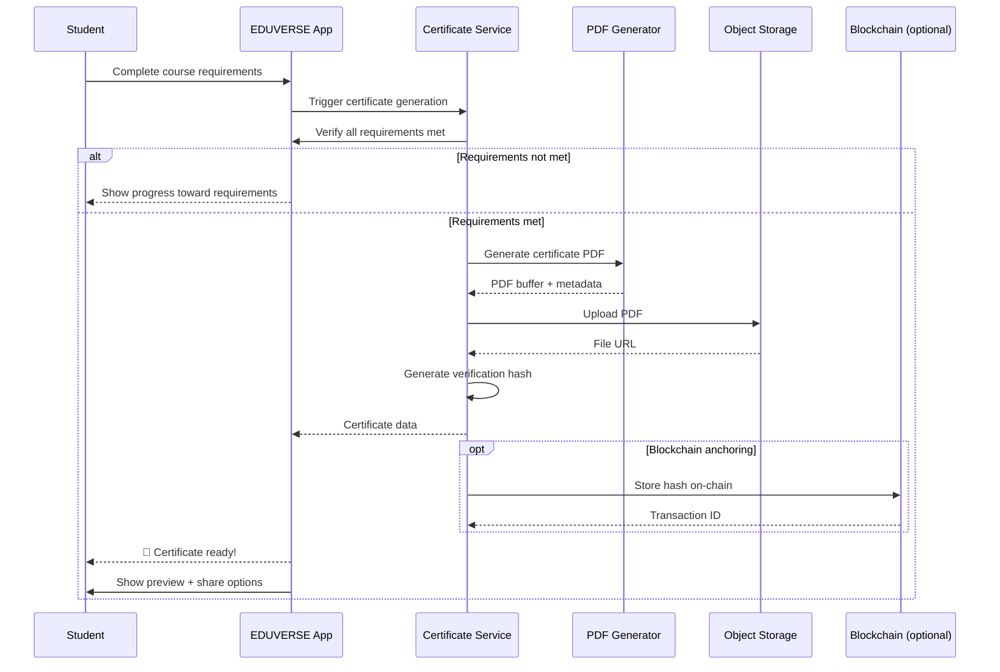

# 🏆 Certification Engine

## Overview

The EDUVERSE Certification Engine issues verifiable digital credentials for course completion, skill mastery, and academic achievements. Certificates are tamper-evident, shareable, and compliant with Open Badges 3.0 standard.

## Certificate Types

| Type | Trigger | Design |
|------|---------|--------|
| **Course Completion** | Complete all required modules and pass final assessment | Course branding |
| **Skill Badge** | Demonstrate mastery in a specific skill area | Micro-credential |
| **Honors Certificate** | Achieve > 90% in all assessments | Premium design |
| **Instructor Certificate** | Instructor issues for exceptional work | Customizable |
| **Proctored Exam** | Pass proctored final exam | Exam-specific |

## Generation Flow



## Certificate Design

```
┌─────────────────────────────────────────────────┐
│              ╔══════════════╗                    │
│              ║   EDUVERSE   ║                    │
│              ╚══════════════╝                    │
│                                                 │
│          Certificate of Completion              │
│                                                 │
│                This certifies                   │
│                                                 │
│              🎓 Student Name                    │
│                                                 │
│         has successfully completed              │
│                                                 │
│          📚 Course Name                         │
│                                                 │
│                  with                           │
│                                                 │
│              Grade: A (95%)                     │
│                                                 │
│          Date: May 22, 2025                     │
│                                                 │
│  ───────────────────────────────────────        │
│                                                 │
│  Verification: eduverse.com/verify/ABC123       │
│                                                 │
│  ┌──────────────┐   ┌──────────────┐           │
│  │   Instructor  │   │  Institution │           │
│  │   Signature   │   │    Seal      │           │
│  └──────────────┘   └──────────────┘           │
└─────────────────────────────────────────────────┘
```

## Verification System

### Verification Methods

1. **URL Verification**: `https://eduverse.com/verify/{certificate-id}`
2. **QR Code**: Embedded QR code linking to verification page
3. **Blockchain**: Optional Ethereum-based hash verification
4. **Open Badges 3.0**: W3C Verifiable Credential standard

### Verification API

```typescript
// Verify a certificate
GET /api/certificates/verify/:certificateId
Response: {
  valid: boolean;
  certificate: {
    studentName: string;
    courseName: string;
    issueDate: string;
    grade: string;
    issuer: string;
  } | null;
  blockchainTx?: string;
}
```

## Implementation

### Certificate Model

```prisma
model Certificate {
  id             String   @id @default(cuid())
  studentId      String
  courseId       String
  type           CertificateType
  grade          String?
  issuedAt       DateTime @default(now())
  verificationHash String  @unique
  pdfUrl         String
  blockchainTx   String?
  revoked        Boolean  @default(false)
  revokedAt      DateTime?
  metadata       Json     // course details, scores, etc.
}

enum CertificateType {
  COURSE_COMPLETION
  SKILL_BADGE
  HONORS
  INSTRUCTOR_AWARD
  PROCTORED_EXAM
}
```

### PDF Generation

```typescript
import { PDFDocument, rgb, StandardFonts } from "pdf-lib";
import { S3Client, PutObjectCommand } from "@aws-sdk/client-s3";

export async function generateCertificate(data: CertificateData) {
  const pdfDoc = await PDFDocument.create();
  const page = pdfDoc.addPage([842, 595]); // A4 landscape

  const font = await pdfDoc.embedFont(StandardFonts.HelveticaBold);
  const regularFont = await pdfDoc.embedFont(StandardFonts.Helvetica);

  // Draw certificate content
  page.drawText("EDUVERSE", {
    x: 421, y: 450, size: 48, font,
    color: rgb(0.976, 0.451, 0.086),
    textAlign: "center",
  });

  page.drawText("Certificate of Completion", {
    x: 421, y: 390, size: 24, font: regularFont,
    color: rgb(0.2, 0.2, 0.2),
  });

  // ... more content

  const pdfBytes = await pdfDoc.save();
  const pdfUrl = await uploadToS3(pdfBytes, data.studentId);
  return pdfUrl;
}
```

## Badge System

EDUVERSE badges follow the Open Badges 3.0 specification.

```json
{
  "@context": [
    "https://www.w3.org/2018/credentials/v1",
    "https://purl.imsglobal.org/spec/ob/v3p0/context-3.0.3.json"
  ],
  "id": "https://eduverse.com/badges/abc123",
  "type": ["VerifiableCredential", "OpenBadgeCredential"],
  "issuer": {
    "id": "https://eduverse.com",
    "name": "EDUVERSE",
    "type": "Profile"
  },
  "credentialSubject": {
    "id": "did:example:student123",
    "name": "Student Name",
    "achievement": {
      "id": "https://eduverse.com/achievements/master-python",
      "type": "Achievement",
      "name": "Python Master",
      "description": "Demonstrated mastery of Python programming"
    }
  }
}
```

## Sharing

| Platform | Integration |
|----------|-------------|
| LinkedIn | Add certification to profile section via API |
| Twitter/X | Share card with certificate preview |
| Email | Send certificate as PDF attachment |
| Embed | iframe embed for portfolio sites |
| Download | Direct PDF download |

## Related

- [Student Analytics](./student-analytics.md)
- [Learning Paths](./learning-paths.md)
