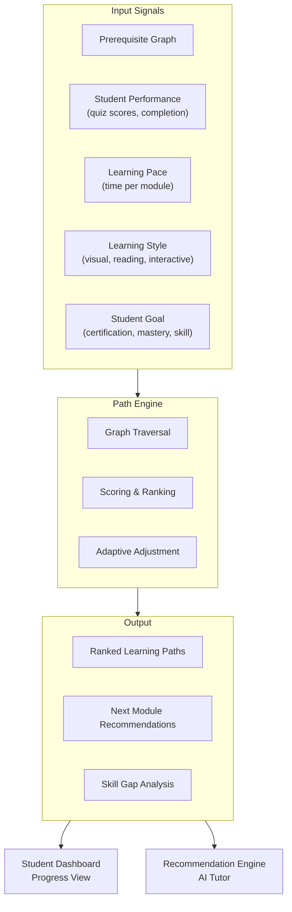

# 🎯 Learning Paths

## Overview

EDUVERSE uses adaptive learning paths to create personalized educational journeys for each student. Learning paths are dynamically generated based on prerequisite graphs, student performance, and learning goals.

## Architecture



## Path Generation Algorithm

### Step 1: Prerequisite Traversal

```
For each target skill/course:
  1. Build directed graph of prerequisites
  2. Identify all pathways from current knowledge state to target
  3. Score each path by:
     - Total estimated time
     - Difficulty progression (smooth vs. steep)
     - Student's historical success rate with similar content
```

### Step 2: Personalization Scoring

```typescript
interface PathScore {
  pathId: string;
  relevanceScore: number;   // 0-1: alignment with student goals
  difficultyFit: number;    // 0-1: matches optimal challenge zone
  timeFit: number;          // 0-1: matches available study time
  completionProb: number;   // 0-1: predicted completion likelihood
}

function calculatePathScore(
  path: LearningPath,
  student: StudentProfile
): PathScore {
  return {
    pathId: path.id,
    relevanceScore: cosineSimilarity(path.skills, student.goals),
    difficultyFit: 1 - Math.abs(path.difficulty - student.optimalDifficulty),
    timeFit: Math.min(student.weeklyHours / path.estimatedWeeklyHours, 1),
    completionProb: logisticRegression([
      student.completionRate,
      student.avgSessionLength,
      student.engagementScore
    ]),
  };
}
```

## Adaptive Adjustment

As students progress, the path engine continuously adjusts:

| Signal | Adjustment |
|--------|------------|
| Student completes modules faster than estimated | Accelerate path, add enrichment |
| Student struggles with quizzes | Recommend review modules, adjust pace |
| Student shows particular interest in topic | Offer branching paths with deeper dives |
| Extended absence detected | Suggest review modules before continuing |

## Implementation

### Server Component

```typescript
// src/components/courses/learning-path.tsx
export async function LearningPath({ studentId }: { studentId: string }) {
  const path = await generatePersonalizedPath(studentId);
  return (
    <div className="space-y-4">
      {path.modules.map((module, index) => (
        <PathModule
          key={module.id}
          module={module}
          position={index}
          total={path.modules.length}
        />
      ))}
    </div>
  );
}
```

### Data Model

```prisma
model LearningPath {
  id         String   @id @default(cuid())
  studentId  String
  courseId   String
  modules    Json     // Ordered array of module IDs with metadata
  score      Float    // Overall path score
  active     Boolean  @default(true)
  createdAt  DateTime @default(now())
  updatedAt  DateTime @updatedAt
}

model SkillNode {
  id          String   @id @default(cuid())
  name        String
  category    String   // "math", "programming", "language"
  prerequisites String[] // IDs of prerequisite SkillNodes
  difficulty  Float    // 0.0 to 1.0
  estimatedHours Float
}
```

## Related

- [Student Analytics](./student-analytics.md)
- [Architecture Overview](../ARCHITECTURE.md)
