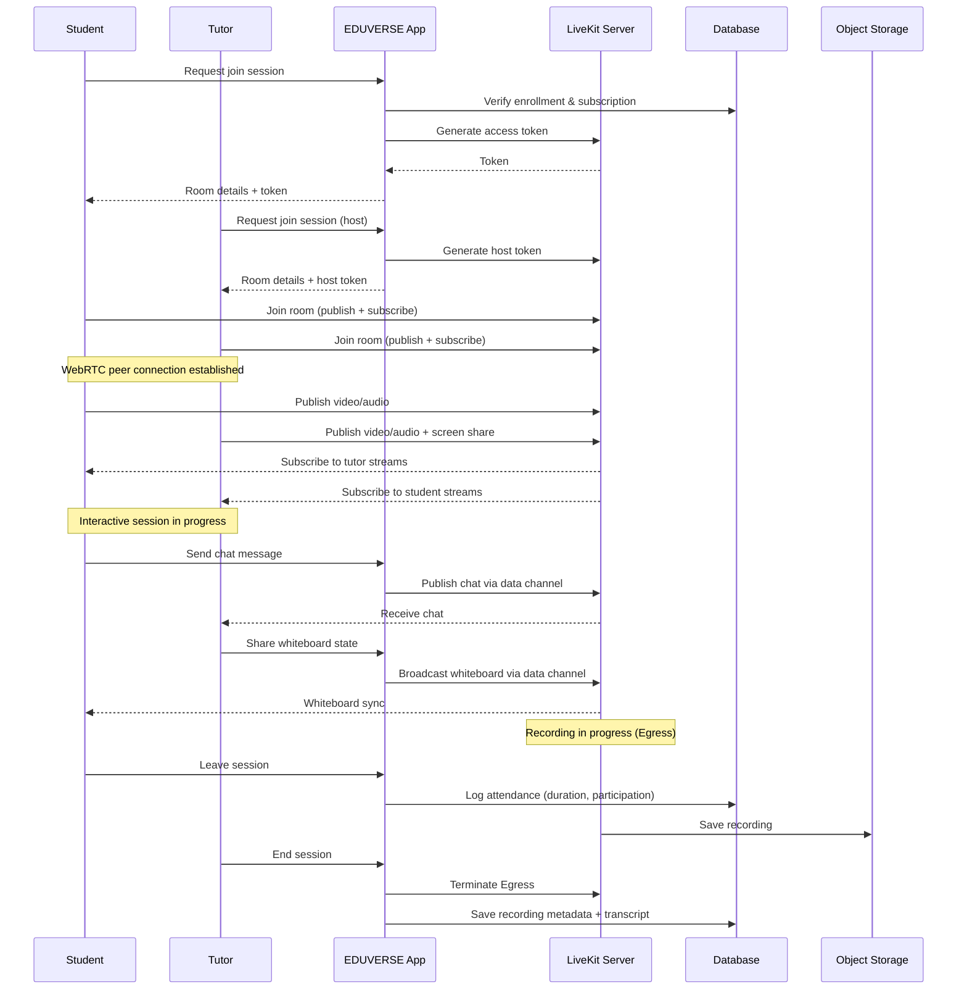

# 🎥 Live Classes

## Overview

EDUVERSE Live Classes provide real-time interactive learning sessions using WebRTC technology powered by LiveKit. Sessions support video streaming, collaborative whiteboarding, screen sharing, breakout rooms, and automatic recording.

## Architecture



## Setup

### LiveKit Configuration

```env
# .env.local
NEXT_PUBLIC_LIVEKIT_URL=wss://your-instance.livekit.cloud
LIVEKIT_API_KEY=your-api-key
LIVEKIT_API_SECRET=your-api-secret
```

### Server-Side Token Generation

```typescript
// src/lib/livekit.ts
import { AccessToken } from "livekit-server-sdk";

export async function createLiveKitRoom(roomName: string) {
  const at = new AccessToken(
    process.env.LIVEKIT_API_KEY!,
    process.env.LIVEKIT_API_SECRET!,
    {
      identity: "server",
      ttl: "10m",
    }
  );
  at.addGrant({
    roomCreate: true,
    roomJoin: true,
    room: roomName,
    canPublish: true,
    canSubscribe: true,
  });
  return at.toJwt();
}

export async function createParticipantToken(
  roomName: string,
  identity: string,
  isHost: boolean
) {
  const at = new AccessToken(
    process.env.LIVEKIT_API_KEY!,
    process.env.LIVEKIT_API_SECRET!,
    { identity, ttl: "2h" }
  );
  at.addGrant({
    roomJoin: true,
    room: roomName,
    canPublish: true,
    canSubscribe: true,
    canPublishData: true,
    canPublishSources: isHost
      ? ["camera", "microphone", "screen_share"]
      : ["camera", "microphone"],
  });
  return at.toJwt();
}
```

## Components

### LiveSession Component

```typescript
"use client";

import { LiveKitRoom, VideoConference } from "@livekit/components-react";

export function LiveSession({ roomName, token }: LiveSessionProps) {
  return (
    <LiveKitRoom
      serverUrl={process.env.NEXT_PUBLIC_LIVEKIT_URL}
      token={token}
      connect={true}
      audio={true}
      video={true}
    >
      <VideoConference />
    </LiveKitRoom>
  );
}
```

### Whiteboard Integration

```typescript
"use client";

import { useWhiteboard } from "@/lib/hooks/use-whiteboard";

export function CollaborativeWhiteboard({ roomName }: { roomName: string }) {
  const { canvasRef, tools, undo, clear } = useWhiteboard(roomName);

  return (
    <div className="relative h-full w-full rounded-lg border bg-white">
      <Toolbar tools={tools} onUndo={undo} onClear={clear} />
      <canvas ref={canvasRef} className="h-full w-full" />
    </div>
  );
}
```

## Session Features

| Feature | Status | Description |
|---------|--------|-------------|
| Video/Audio Streaming | ✅ | Bi-directional WebRTC |
| Screen Sharing | ✅ | Tutor shares screen |
| Collaborative Whiteboard | ✅ | Real-time drawing |
| Breakout Rooms | 🚧 | Small group discussions |
| Recording | ✅ | Auto-record with LiveKit Egress |
| Live Transcription | 🚧 | Real-time captions |
| Chat | ✅ | In-session Q&A |
| Polls | 🚧 | Live polling during session |
| Hand Raise | ✅ | Student hand raise with notification |
| Attendance Tracking | ✅ | Auto-log join/leave times |

## Session Lifecycle

```
Created ──► Scheduled ──► Live ──► Ended ──► Archived
  │            │            │        │
  │            │            │        ├── Recording processed
  │            │            │        ├── Transcript generated
  │            │            │        └── Analytics updated
  │            │            │
  │            │            ├── Breakout rooms open/close
  │            │            └── Chat messages logged
  │            │
  │            ├── Reminder sent (1 hour before)
  │            └── Token pre-generated
  │
  └── Draft state (editable)
```

## Quality Targets

| Metric | Target |
|--------|--------|
| Video Latency (p95) | < 200ms |
| Audio Latency (p95) | < 100ms |
| Join Time (p95) | < 3s |
| Packet Loss | < 1% |
| Uptime | 99.9% |
| Max Participants per Room | 50 |
| Max Concurrent Rooms | 100 |

## Related

- [Architecture Overview](../ARCHITECTURE.md)
- [Student Analytics](./student-analytics.md)
