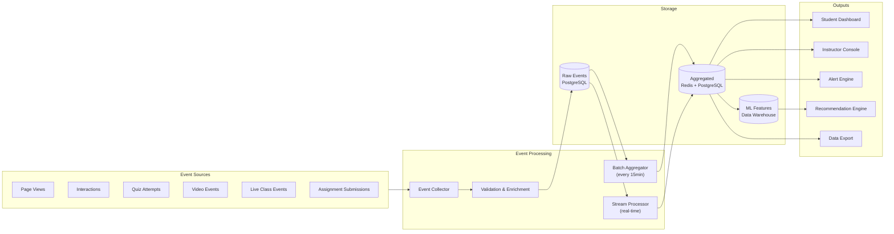

# 📊 Student Analytics

## Overview

EDUVERSE provides comprehensive analytics for students, instructors, and administrators. The analytics pipeline processes events from the platform in real-time and in batch to generate actionable insights.

## Event Pipeline



## Key Metrics

### Engagement Metrics

| Metric | Definition | Calculation |
|--------|------------|-------------|
| **Engagement Score** | Overall platform engagement | `(active_minutes / total_minutes) × social_bonus` |
| **Session Length** | Average time per visit | `SUM(session_durations) / COUNT(sessions)` |
| **Return Rate** | How often students return | `returning_users / total_users (weekly)` |
| **Feature Adoption** | Usage of specific features | `users_feature / users_total` |

### Learning Metrics

| Metric | Definition | Calculation |
|--------|------------|-------------|
| **Progress Rate** | Course completion progress | `completed_modules / total_modules_in_path` |
| **Mastery Level** | Skill competency score | `weighted_avg(quiz_scores × recency_factor)` |
| **Retention Rate** | Knowledge retention | `score_on_review / score_on_initial` |
| **Completion Rate** | Course completion | `completed_courses / enrolled_courses` |

### At-Risk Prediction

The at-risk model uses logistic regression with the following features:

```typescript
interface AtRiskFeatures {
  engagementScore: number;      // Last 7 days
  progressRate: number;         // Overall course progress
  quizPerformance: number;      // Average quiz score (last 5)
  attendanceRate: number;       // Live class attendance
  socialParticipation: number;  // Forum posts, messages
  timeSinceLastLogin: number;   // Days
  streakLength: number;         // Current streak
  previousAtRiskScore: number;  // Previous prediction
}
```

**Intervention Triggers:**

| Score | Risk Level | Action |
|-------|------------|--------|
| 0.0 - 0.3 | Low | No action needed |
| 0.3 - 0.6 | Medium | Send encouragement email, suggest tutor |
| 0.6 - 0.8 | High | Notify instructor, offer 1-on-1 session |
| 0.8 - 1.0 | Critical | Direct instructor intervention, parent/guardian notification |

## Analytics Components

### Student Dashboard

```
┌─────────────────────────────────────────────────┐
│  📊 Your Learning Overview                       │
├─────────────────┬───────────────────────────────┤
│  Engagement     │  Progress Timeline            │
│  ┌───────────┐  │  ┌─────────────────────────┐  │
│  │  78%      │  │  │ ████████░░░░░░░░░░░░  │  │
│  │  This Week │  │  │ Python Basics   80%   │  │
│  └───────────┘  │  │ ██████████░░░░░░░░░░  │  │
│                 │  │ │ Math 301      55%   │  │
│  Streak: 15🔥   │  │ ████████████████░░░░  │  │
│  XP: 2,450     │  │ │ SQL           20%   │  │
│                 │  │ └─────────────────────────┘  │
├─────────────────┼───────────────────────────────┤
│  Skill Graph    │  Recommended Actions           │
│  ┌───────────┐  │  ┌─────────────────────────┐  │
│  │  Visual    │  │  │ 📝 Physics HW due tomorrow│  │
│  │  skill     │  │  │ 🎯 Live Review: Math 301  │  │
│  │  network   │  │  │ 👨‍🏫 Book Python Tutor   │  │
│  └───────────┘  │  └─────────────────────────┘  │
└─────────────────┴───────────────────────────────┘
```

### Instructor Console

| View | Metrics | Purpose |
|------|---------|---------|
| **Class Overview** | Avg engagement, completion rates, at-risk count | Quick health check |
| **Student Detail** | Individual progress, quiz history, activity log | Intervention targeting |
| **Content Analytics** | Module completion rates, drop-off points | Content improvement |
| **Comparative** | Section vs. section, historical trends | Teaching effectiveness |

## Data Export

```bash
# Export course analytics as CSV
GET /api/analytics/export?courseId=123&format=csv

# Export student progress as PDF
GET /api/analytics/export?studentId=456&format=pdf

# Schedule recurring export
POST /api/analytics/export/schedule
{
  "format": "csv",
  "frequency": "weekly",
  "recipients": ["instructor@school.edu"]
}
```

## Privacy & Data Governance

- All analytics data is aggregated and anonymized where possible
- Individual student data access is restricted to instructors and admins
- Students can view their own analytics but not others'
- Data retention: 3 years for analytics, 90 days for raw events
- GDPR right to deletion applies to all personal analytics data

## Related

- [Learning Paths](./learning-paths.md)
- [Architecture Overview](../ARCHITECTURE.md)
